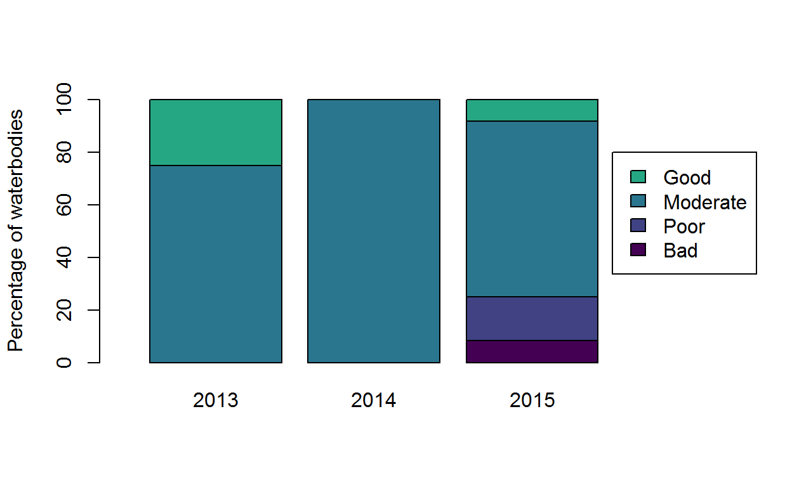

# Summary

Globally, issues around water quality and quantity are expected to increase in coming decades, set against a background of already widespread degradation [@WWAPUnitedNationsWorldWaterAssessmentProgramme/UN-Water2018]. Within Europe, the [Water Framework Directive](http://ec.europa.eu/environment/water/water-framework/index_en.html) (WFD) set EU-wide standards for how the quality of surface- and ground-waters across Europe is assessed and classified [@Communities2000]. Assessment of quality using the WFD is based on a range of elements that vary depending on the type of water being assessed. The elements cover biological, chemical and hydromorphological/quantitative components with a hierarchical structure. These are combined to give an overall classification of waterbodies into five classes (High, Good, Moderate, Poor and Bad) for surface waters and two classes (Good or Poor) for groundwaters. The overall aim of the WFD is that all European surface and ground waters will reach at least Good status by 2027, although there have been a number of issues with implementation [@Voulvoulis2017].

In the UK, the Environment Agency (EA) is the competent authority responsible for monitoring and assessment of water quality within England. The EA have made the reporting data relating to the requirements of the WFD available via the Catchment Data Explorer (CDE) website [https://environment.data.gov.uk/catchment-planning/](https://environment.data.gov.uk/catchment-planning/). The ``cde`` package for R [@RCoreTeam2019] provides functions that facilitate the querying, download and plotting of the data available on the CDE site, allowing efficient collation of data for the analysis of trends or patterns in water quality and pressures on waterbodies across England.

The package allows users to search for waterbodies, catchments or River Basin Districts that match given search strings. Having identified the relevant sites, the following types of data can be downloaded:

*Status classification data*: either for overall waterbody classification or at a range of more detailed levels relating to specific quality elements (e.g. ecological, chemical or priority substances). These can be downloaded for specified year ranges and for specific waterbody types (such as lakes).

*Reasons for Not Achieving Good status*: For catchments or River Basin Districts where there are waterbodies that have not achieved Good status, the package provides the functionality to download a summary of the Reasons for Not Achieving Good (RNAG) data. This gives a range of information regarding the relevant pressures identified as contributing to the current status, classified according to a standard hierarchy given on the CDE website.

*Objectives for waterbodies*: Where less than Good status has been achieved, data on the objectives that have been set in terms of status aimed for in the longer term can be downloaded, for specific target years and for specified levels of classification.

*Measures to achieve objectives*: Details of actions that have been put in place or are proposed to achieve the objectives set (currently in relation to the target objective set for 2021). Only data linked to the achievement of a specific outcome in terms of status are included.

*Protected areas*: The package also provides a function to download a summary of associated protected areas (such as Special Areas of Conservation or Nitrate Vulnerable Zones), again at a range of levels from individual waterbodies to whole River Basin Districts.

For each of the types of data that can be downloaded, summary plots can also be produced. These differ depending on the type of data, but an example showing the percentage of water bodies in each status class (derived from the ``get_status`` function) is shown in Figure 1.

{ width=80% }

# Acknowledgements

Thanks to Matt Starr of the EA and Dave Reynolds of Epimorphics Ltd for useful discussions about the CDE API and providing a full site listing to help development.

# References
